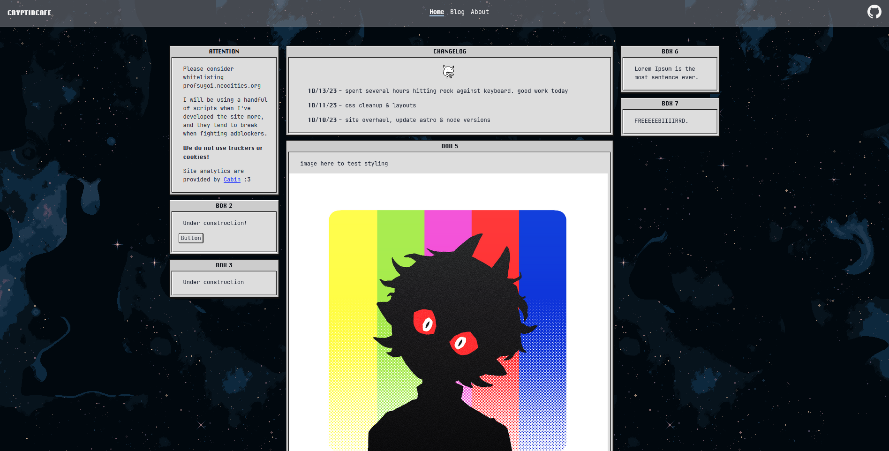

# スゴイ

Sugoi's personal site on Neocities  
[Frontend To-Do](TO-DO.md)

## CORE

The meaty stuff

- [Hosted with Neocities](https://neocities.org/) ヽ( ・ω・)ﾉ
- [Astro Docs](https://docs.astro.build) - frontend

## MISC

Templates and tools used

- [Deploy-Astro-Neocities](https://github.com/professorsugoi/Deploy-Astro-Neocities) - github actions
- [New Dawn](https://github.com/npjg/classic.css) - css framework
- [Space BG](https://deep-fold.itch.io/space-background-generator) - by deep-fold on itch.io
- [Mon Sprite](https://opengameart.org/content/cute-monster-sprite-sheet) - by dogchicken
- Fonts: [ChicagoFLF](https://github.com/npjg/classic.css/tree/master/fonts) (self-hosted) & [JetBrainsMono](https://www.jetbrains.com/lp/mono/) (served by [bunny.net](https://fonts.bunny.net/family/jetbrains-mono))
